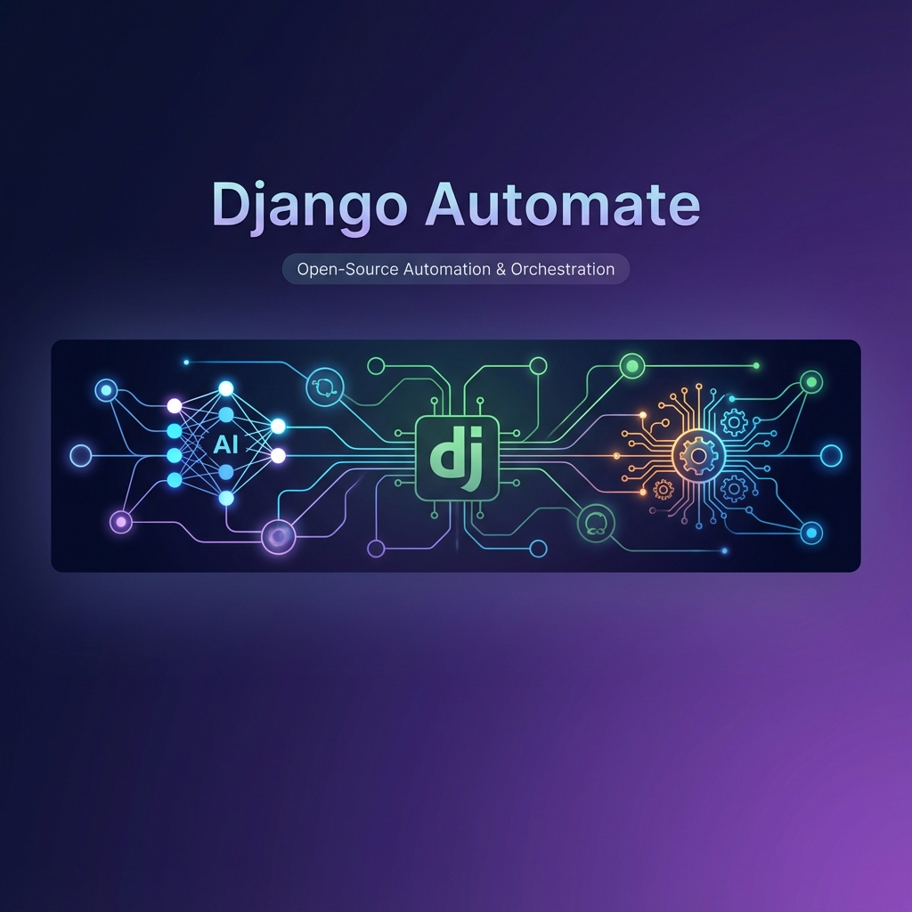
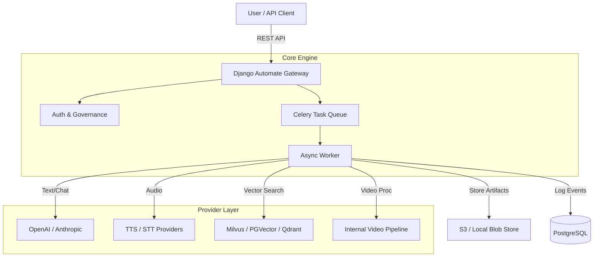

<p align="center">
  
</p>

<h1 align="center">Django Automate</h1>

<p align="center">
  <strong>The admin-first automation framework for LLM + RAG + Connectors</strong>
</p>

<p align="center">
  <a href="https://github.com/codegraphers/django-automate/actions/workflows/ci.yml">
    
  </a>
  <a href="https://pypi.org/project/django-automate/">
    
  </a>
  <a href="https://pypi.org/project/django-automate/">
    
  </a>
  <a href="https://github.com/codegraphers/django-automate/blob/main/LICENSE">
    
  </a>
  <a href="https://codegraphers.github.io/django-automate/">
    
  </a>
</p>

---

Django Automate bridges the gap between proof-of-concept AI scripts and reliable enterprise platforms. It provides a unified, secure gateway to manage **LLMs**, **Audio (TTS/STT)**, **Video processing**, and **RAG pipelines**—all integrated natively into Django's ORM and Admin interface.

## ✨ Key Features

| Feature | Description |
| :--- | :--- |
| 🤖 **Multi-Modal Gateway** | Unified API for **Text** (GPT-4, Claude), **Audio** (Deepgram, OpenAI TTS/STT), and **Video** (FFmpeg, Whisper). Switch providers with zero code changes. |
| 🧠 **RAG Subsystem** | Built-in **RAG pipelines** with support for Milvus, PGVector, and Qdrant. Manage knowledge bases, embeddings, and vector stores directly from the admin panel. |
| 💬 **Data Chat (NL2SQL)** | AI-powered natural language interface for querying your Django database. Ask questions in plain English and get SQL-backed answers with full security policies. |
| 🛡️ **Enterprise Security** | **SSRF Protection** for all outbound requests. **SecretRef** architecture ensures API keys are never exposed. **RBAC** and **Budget Limits** per endpoint. |
| ⚡ **Async Automation** | Scalable execution engine powered by **Celery & Redis**. Handle long-running transcripts or massive batch jobs without blocking your API. |
| 📊 **Full Observability** | Audit trails, job history, LLM request logging, and cost tracking stored in your database. Debug AI interactions with the built-in **Test Console**. |
| 🔌 **Extensible Connectors** | Pre-built connectors for Slack, HTTP webhooks, and more. Easily add custom connectors using the provider pattern. |
| 🎨 **Admin Studio** | Rich Django Admin interface with import/export, JSON widgets, autocomplete, and live test consoles for all integrations. |

## 🏗️ Architecture



## 📦 Installation

### Using pip

```bash
# Core installation
pip install django-automate

# With LLM providers
pip install "django-automate[llm-openai,llm-anthropic]"

# With RAG backends
pip install "django-automate[rag-milvus,rag-pgvector]"

# Full installation with all providers
pip install "django-automate[full]"
```

### Available Extras

| Extra | Description |
| :--- | :--- |
| `dev` | Development dependencies (pytest, ruff, mypy) |
| `llm-openai` | OpenAI provider (GPT-4, Whisper, TTS) |
| `llm-anthropic` | Anthropic provider (Claude) |
| `rag-milvus` | Milvus vector store |
| `rag-pgvector` | PostgreSQL pgvector extension |
| `rag-qdrant` | Qdrant vector store |
| `connectors-slack` | Slack connector |
| `connectors-http` | HTTP/Webhook connector |
| `observability` | OpenTelemetry integration |
| `full` | All optional dependencies |

### Django Setup

```python
# settings.py
INSTALLED_APPS = [
    # ... Django apps ...
    
    # Core
    "automate",
    "automate_core",
    "automate_api",
    
    # Features (add as needed)
    "automate_modal",       # Multi-modal AI Gateway
    "automate_llm",         # LLM providers
    "automate_rag",         # RAG subsystem
    "rag",                  # RAG models and views
    "automate_datachat",    # NL2SQL chat
    "automate_connectors",  # External connectors
    "automate_governance",  # RBAC & policies
    "automate_observability", # Logging & metrics
    "automate_studio",      # Enhanced admin UI
]
```

## ⚡ Quickstart

Get a full stack (App + Postgres + Redis) running in 2 minutes.

### 1. Clone and Configure

```bash
git clone https://github.com/codegraphers/django-automate.git
cd django-automate
cp .env.example .env
# Edit .env with your API keys
```

### 2. Start the Stack

```bash
make dev
```

This starts PostgreSQL, Redis, and the Django development server.

*Access the Admin at [http://localhost:8000/admin/](http://localhost:8000/admin/)*

### 3. Verify Health

```bash
make doctor
```

### 4. Run Tests

```bash
make test
```

## 🗂️ Project Structure

```
django-automate/
├── src/                          # Source code
│   ├── automate/                 # Core framework (signals, registry, dispatcher)
│   │   ├── admin.py              # Base admin configuration
│   │   ├── dispatcher.py         # Outbox pattern implementation
│   │   ├── models.py             # Core models (Automation, Event, Workflow)
│   │   ├── runtime.py            # Execution engine
│   │   └── management/           # Django management commands
│   │
│   ├── automate_api/             # REST API layer
│   │   └── v1/                   # API v1 endpoints
│   │
│   ├── automate_core/            # Core models and utilities
│   │   ├── workflows/            # Workflow definitions
│   │   ├── events/               # Event management
│   │   ├── executions/           # Execution tracking
│   │   └── jobs/                 # Background jobs
│   │
│   ├── automate_modal/           # Multi-Modal AI Gateway
│   │   ├── audio/                # TTS/STT providers
│   │   ├── video/                # Video processing
│   │   └── text/                 # Chat/completion models
│   │
│   ├── automate_llm/             # LLM subsystem
│   │   ├── providers/            # OpenAI, Anthropic backends
│   │   ├── prompts/              # Prompt management
│   │   ├── runs/                 # LLM run tracking
│   │   └── sessions/             # Session pooling
│   │
│   ├── automate_rag/             # RAG subsystem config
│   ├── rag/                      # RAG implementation
│   │   ├── embeddings/           # Embedding models
│   │   ├── vectorstores/         # Milvus, PGVector, Qdrant
│   │   └── endpoints/            # RAG query endpoints
│   │
│   ├── automate_datachat/        # NL2SQL chat interface
│   │   ├── registry.py           # Model registration
│   │   ├── runtime.py            # Query execution
│   │   └── sqlpolicy.py          # SQL validation
│   │
│   ├── automate_connectors/      # External integrations
│   │   ├── slack/                # Slack connector
│   │   └── http/                 # Webhook connector
│   │
│   ├── automate_governance/      # Security & RBAC
│   │   ├── policies/             # Access policies
│   │   └── secrets/              # SecretRef management
│   │
│   ├── automate_observability/   # Logging & metrics
│   └── automate_studio/          # Admin UI enhancements
│
├── docs/                         # MkDocs documentation source
│   ├── quickstart/               # Getting started guides
│   ├── concepts/                 # Architecture concepts
│   ├── tutorials/                # Step-by-step tutorials
│   ├── how-to/                   # How-to guides
│   ├── reference/                # API reference
│   ├── features/                 # Feature documentation
│   └── security/                 # Security documentation
│
├── examples/                     # Example applications
│   ├── webhook_to_llm/           # Webhook to LLM pipeline
│   └── docker/                   # Production Docker setup
│
├── tests/                        # Test suite
│   ├── unit/                     # Unit tests
│   ├── e2e/                      # End-to-end tests
│   ├── security/                 # Security tests
│   └── llm/                      # LLM integration tests
│
├── .github/workflows/            # CI/CD pipelines
│   ├── ci.yml                    # Continuous integration
│   ├── release.yml               # PyPI publishing
│   └── deploy-docs.yml           # Documentation deployment
│
├── docker-compose.yml            # Local development stack
├── Dockerfile                    # Container image
├── Makefile                      # Developer commands
├── pyproject.toml                # Python package config
└── mkdocs.yml                    # Documentation config
```

## 💡 Use Cases

### 1. Video Intelligence Pipeline

Upload a raw video → Secure download → Extract audio → Transcribe (Whisper) → Summarize (GPT-4) → Generate tags.

```python
from automate_modal.services import ModalService

result = await ModalService.process_video(
    url="https://example.com/video.mp4",
    steps=["download", "extract_audio", "transcribe", "summarize", "tag"]
)
```

### 2. Enterprise RAG Knowledge Base

Upload internal documents → Chunk & embed → Store in Milvus → Question answering API with access controls.

```python
from rag.endpoints import query_endpoint

results = query_endpoint(
    slug="internal-policies",
    query="What is the vacation policy?",
    top_k=5
)
```

### 3. Natural Language Database Queries

Allow staff to query your database using natural language with full SQL security validation.

```python
# Automatically available in Django Admin
# Or via API:
POST /datachat/api/chat/
{"message": "Show me top 10 customers by total orders this month"}
```

### 4. Multi-Provider LLM Router

Avoid vendor lock-in with seamless provider switching and A/B testing.

```python
from automate_llm.service import LLMService

# Configured via admin - switch providers without code changes
response = await LLMService.complete(
    prompt="Summarize this document",
    model="default"  # Resolves to configured provider
)
```

## 🔐 Security

We take security seriously. Key security features include:

| Feature | Description |
| :--- | :--- |
| **SecretRef** | Secrets are never stored in plain text. Use `env://VAR` or `db://secret_name` references. |
| **SSRF Protection** | Outbound requests are validated against allowlists. Private IPs are blocked. |
| **RBAC** | Tenant isolation enforced at the database level. Fine-grained access policies per endpoint. |
| **SQL Policy** | Data Chat only allows read-only queries on registered models. |
| **Audit Logging** | All actions are logged with trace IDs for compliance. |
| **Redaction** | Sensitive fields auto-redacted in logs and UI. Raw access requires special permissions. |

See [SECURITY.md](SECURITY.md) for reporting vulnerabilities.

## 📚 Documentation

Full documentation is available at [codegraphers.github.io/django-automate](https://codegraphers.github.io/django-automate/) or locally:

```bash
mkdocs serve
# Open http://localhost:8001
```

### Quick Links

- [Quickstart Guide](docs/01_quickstart.md)
- [Architecture Concepts](docs/02_concepts.md)
- [API Reference](docs/05_reference.md)
- [Extension Points](docs/reference/extension-points.md)
- [RAG Subsystem](docs/features/rag.md)
- [Data Chat](docs/features/datachat.md)

## 🛠️ Development

```bash
# Install dev dependencies
pip install -e ".[dev]"

# Run tests
make test

# Lint code
make lint

# Format code
make format

# Run smoke test (boots Django with all modules)
make smoke
```

### Compatibility

| Component | Versions |
| :--- | :--- |
| Python | 3.10, 3.11, 3.12 |
| Django | 4.2 (LTS), 5.0+ |
| DRF | 3.14+ |
| PostgreSQL | Recommended (required for `SKIP LOCKED`) |
| MySQL | 8+ (no JSON index optimizations) |
| SQLite | Development/test only |

## 🤝 Contributing

We welcome contributions! See [CONTRIBUTING.md](CONTRIBUTING.md) for development setup and guidelines.

1. Fork the repository
2. Create a feature branch (`git checkout -b feature/amazing-feature`)
3. Commit your changes (`git commit -m 'Add amazing feature'`)
4. Push to the branch (`git push origin feature/amazing-feature`)
5. Open a Pull Request

## 📋 Changelog

See [CHANGELOG.md](CHANGELOG.md) for release history.

## 📄 License

This project is licensed under the Apache License 2.0 - see the [LICENSE](LICENSE) file for details.

---

<p align="center">
  Made with ❤️ by <a href="https://github.com/codegraphers">CodeGraphers</a>
</p>
