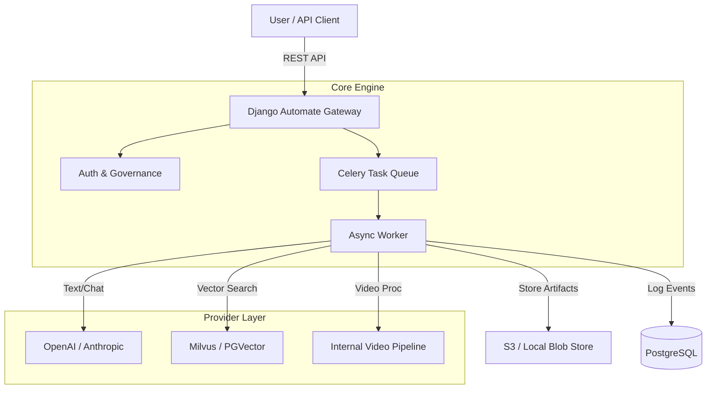

# Django Automate

**The admin-first automation framework for LLM + RAG + connectors.**

Django Automate bridges the gap between proof-of-concept AI scripts and reliable enterprise platforms. It provides a unified, secure gateway to manage LLMs, Audio (TTS/STT), Video processing, and RAG pipelines—all integrated natively into Django's ORM and Admin interface.


## 🚀 Why Django Automate?

| Feature | Description |
| :--- | :--- |
| **🤖 Multi-Modal Gateway** | Unified API for **Text** (GPT-4, Claude), **Audio** (Deepgram, OpenAI), and **Video** (FFmpeg, Whisper). Switch providers with zero code changes. |
| **🧠 RAG Subsystem** | Built-in simplified **RAG pipelines**. Manage knowledge bases, vector stores (Milvus, PGVector), and embeddings directly from the admin panel. |
| **🛡️ Enterprise Security** | **SSRF Protection** for all outbound requests. **SecretRef** architecture ensures API keys are never exposed in code or logs. **RBAC** and **Budget Limits** per endpoint. |
| **⚡ Async Automation** | Scalable execution engine powered by **Celery & Redis**. Handle long-running video transcripts or massive batch jobs without blocking your API. |
| **📊 Observability** | Full audit trails, job history, and cost tracking stored in your database. Debug AI interactions with the built-in **Test Console**. |

## 🏗️ Architecture



## ⚡ Quickstart

Get a full stack (App + Postgres + Redis) running in 2 minutes.

### 1. Bootstrap
```bash
# Clone and setup env
cp .env.example .env
```

### 2. Start Stack
```bash
make dev
```
*Access the Admin at [http://localhost:8000/admin/](http://localhost:8000/admin/)*

### 3. Verify Health
```bash
make doctor
```

## 💡 Use Cases

### 1. The "Netflix" Video Pipeline
Upload a raw video file -> Download securely (SSRF check) -> Extract Audio -> Transcribe (Whisper) -> Summarize (GPT-4) -> Generate Tags.
*   **Result:** A fully indexed video accessible via API, with all intermediate artifacts stored in S3.

### 2. Enterprise RAG Knowledge Base
Upload internal PDF policies -> Chunk & Embed -> Store in Milvus -> Question Answering API.
*   **Result:** A secure, internal search engine that strictly respects document access permissions.

### 3. Multi-Provider Router
Avoid vendor lock-in. Define a generic "Chat" capability.
*   **Result:** Seamlessly switch traffic or A/B test models without redeploying code.

## 📚 Documentation

- [**Quickstart Guide**](docs/quickstart/first-automation.md)
- [**Architecture**](docs/concepts/architecture.md)
- [**Extension Points**](docs/reference/extension-points.md)

Full documentation available locally:
```bash
mkdocs serve
```
*Hosted at [http://localhost:8001](http://localhost:8001)*

## 📦 Project Structure

```text
├── src/
│   ├── automate/           # Core framework (Signals, Registry)
│   ├── automate_modal/     # The AI Gateway (Models, Jobs, Providers)
│   ├── automate_llm/       # Legacy LLM support (Bridge)
│   └── rag/                # RAG (Embeddings, Vector Stores)
├── examples/
│   ├── webhook_to_llm/     # Golden Path Integration Test
│   └── docker/             # Production-ready Docker Compose stack
├── docs/                   # MkDocs source files
└── .github/workflows/      # CI/CD (TestPyPI, OIDC Publishing)
```

## 🔐 Security

We take security seriously.
- **Secrets**: Never stored in plain text (use `SecretRef`).
- **SSRF**: Outbound requests are validated against allowlists.
- **RBAC**: Tenant isolation is enforced at the DB level.

## 🤝 Contributing

See [CONTRIBUTING.md](CONTRIBUTING.md) for dev setup.

## 📄 License

Apache 2.0
