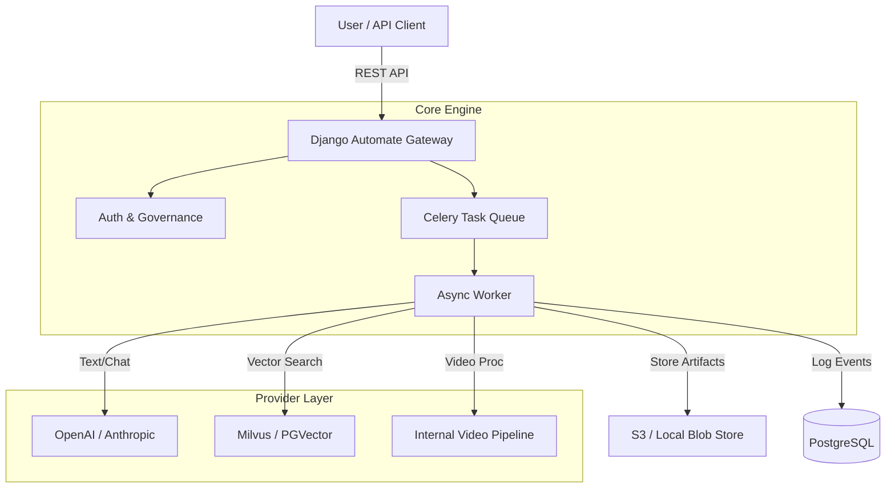

# Django Automate

<div align="center">

[](https://github.com/codegraphers/django-automate/actions/workflows/ci.yml)
[](https://github.com/codegraphers/django-automate/blob/main/LICENSE)
[](https://pypi.org/project/django-automate/)
[](https://github.com/astral-sh/ruff)
<!-- [](https://pypi.org/project/django-automate/) -->
<!-- [](https://pypi.org/project/django-automate/) -->

# The Enterprise AI Gateway for Django

**Orchestrate Multi-Modal AI, RAG Pipelines, and Async Workflows with Production-Grade Security.**

[Documentation](docs/) • [Quickstart](#-quickstart) • [Architecture](#-architecture) • [Contributing](CONTRIBUTING.md)

</div>

---

**Django Automate** bridges the gap between proof-of-concept AI scripts and reliable enterprise platforms. It provides a unified, secure gateway to manage LLMs, Audio (TTS/STT), Video processing, and RAG pipelines—all integrated natively into Django's ORM and Admin interface.

Stop gluing together random Python scripts. Build on a framework designed for governance, scalability, and observability.

## 🚀 Why Django Automate?

| Feature | Description |
| :--- | :--- |
| **🤖 Multi-Modal Gateway** | Unified API for **Text** (GPT-4, Claude), **Audio** (Deepgram, OpenAI), and **Video** (FFmpeg, Whisper). Switch providers with zero code changes. |
| **🧠 RAG Subsystem** | Built-in simplified **RAG pipelines**. Manage knowledge bases, vector stores (Milvus, PGVector), and embeddings directly from the admin panel. |
| **🛡️ Enterprise Security** | **SSRF Protection** for all outbound requests. **SecretRef** architecture ensures API keys are never exposed in code or logs. **RBAC** and **Budget Limits** per endpoint. |
| **⚡ Async Automation** | Scalable execution engine powered by **Celery & Redis**. Handle long-running video transcripts or massive batch jobs without blocking your API. |
| **📊 Observability** | Full audit trails, job history, and cost tracking stored in your database. Debug AI interactions with the built-in **Test Console**. |

## 🏗️ Architecture



## ⚡ Quickstart

Get up and running in minutes.

### 1. Install
django-automate is modular. Install the core with standard dependencies:

```bash
pip install django-automate[celery,rag]
```

### 2. Configure Settings
Add the apps to your `INSTALLED_APPS` and configure the broker:

```python
# settings.py
INSTALLED_APPS = [
    # ... django apps
    "rest_framework",
    "django_filters",
    "automate",           # Core
    "automate_modal",     # AI Gateway
    "rag",                # RAG System
]

# Use Redis + Celery for robust queuing
CELERY_BROKER_URL = "redis://localhost:6379/0"
```

### 3. Run the "Quickstart" Script
We include a zero-config script to verify your environment. It spins up a temporary in-memory environment to test the engine.

```bash
python examples/scripts/quickstart.py
```

*Output:*
```text
✅ Engine initialized.
🚀 Dispatching EchoJob...
✨ Result: {'msg': 'Echo from provider', 'input': 'Hello World'}
```

## 💡 Use Cases

### 1. The "Netflix" Video Pipeline
Upload a raw video file -> Download securely (SSRF check) -> Extract Audio -> Transcribe (Whisper) -> Summarize (GPT-4) -> Generate Tags.
*   **How:** Use `automate_modal` with the `VideoPipelineProvider`.
*   **Result:** A fully indexed video accessible via API, with all intermediate artifacts stored in S3.

### 2. Enterprise RAG Knowledge Base
Upload internal PDF policies -> Chunk & Embed -> Store in Milvus -> Question Answering API.
*   **How:** Use the `rag` app to define a `KnowledgeSource` and `RAGEndpoint`.
*   **Result:** A secure, internal search engine that strictly respects document access permissions.

### 3. Multi-Provider Router
Avoid vendor lock-in. Define a generic "Chat" capability.
*   **How:** Configure `OpenAI` as primary and `Anthropic` as fallback in the `ProviderConfig` admin.
*   **Result:** Seamlessly switch traffic or A/B test models without redeploying code.

## 📦 Project Structure

We follow a professional `src/` layout for clean packaging.

```text
├── src/
│   ├── automate/           # Core framework (Signals, Registry)
│   ├── automate_modal/     # The AI Gateway (Models, Jobs, Providers)
│   ├── automate_llm/       # Legacy LLM support (Bridge)
│   └── rag/                # RAG (Embeddings, Vector Stores)
├── examples/
│   └── docker/             # Production-ready Docker Compose stack
├── docs/                   # MkDocs source files
└── .github/workflows/      # CI/CD (TestPyPI, OIDC Publishing)
```

## 🔧 Deployment

Django Automate is built for containerized environments.

1.  **Environment Variables**: Secure your deployments with `SecretRef`.
    *   `OPENAI_API_KEY`: Managed via Django Admin or env vars.
    *   `CELERY_BROKER_URL`: Point to your managed Redis.
    *   `DATABASE_URL`: Point to PostgreSQL.

2.  **Docker**:
    See `examples/docker/` for a reference `docker-compose.yml` that orchestrates Django, Celery Workers, Redis, and Postgres.

## 🤝 Contributing

We are building the standard for Python AI Automation.
See [CONTRIBUTING.md](CONTRIBUTING.md) for dev setup and guidelines.

## 📄 License

MIT License. Free for commercial and private use.
Copyright (c) 2024 CodeGraphers.
