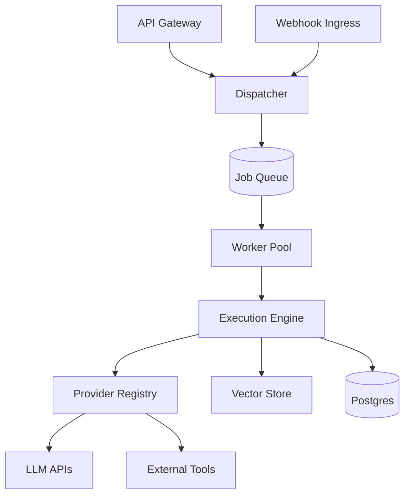

# Architecture

Django Automate is built on a modular "Engine + Plugins" architecture.

## Core Components

### 1. Job Queue (The Spine)
All work is asynchronous. `Job` is the canonical unit of work. Backends (Celery, Redis, SQS) are just transports.

### 2. Execution Engine
A directed acyclic graph (DAG) executor that steps through `Workflow` definitions. It handles state persistence, retries, and error handling.

### 3. Provider Registry
A unified interface for external capabilities. Whether it's OpenAI, a local vector store, or a Slack connector, they all implement `BaseProvider`.

### 4. Admin Studio
The control plane. It provides visibility into queues, executions, and allows for "Human in the Loop" interventions.
