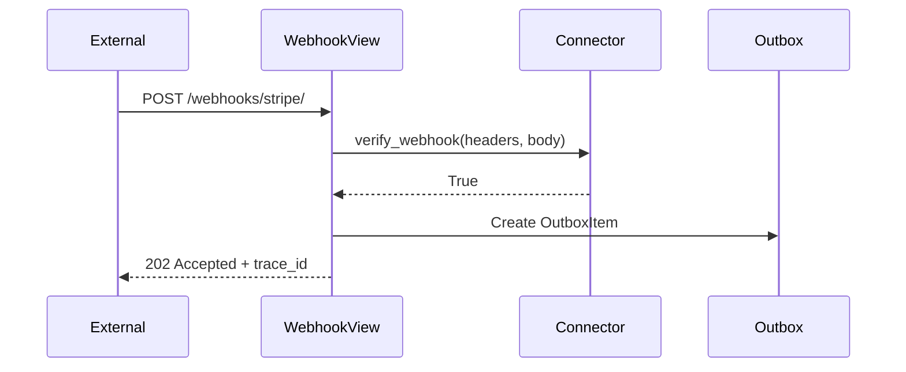

# Integration Patterns

This guide covers common patterns for integrating Django Automate with external systems.

## Table of Contents

1. [Webhook Integration](#webhook-integration)
2. [LLM Provider Integration](#llm-provider-integration)
3. [RAG Backend Integration](#rag-backend-integration)
4. [Connector Development](#connector-development)
5. [MCP Server Integration](#mcp-server-integration)
6. [External API Integration](#external-api-integration)

---

## Webhook Integration

### Receiving Webhooks

Django Automate provides a unified webhook endpoint with signature verification.

```python
# urls.py
from automate.views import WebhookView

urlpatterns = [
    path('webhooks/<str:connector_key>/', WebhookView.as_view()),
]
```

### Webhook Flow



### Custom Verification

```python
from automate_connectors.base import Connector

class MyWebhookConnector(Connector):
    key = "my_service"
    
    def verify_webhook(self, headers: dict, raw_body: bytes) -> bool:
        """Custom signature verification."""
        signature = headers.get('X-Signature')
        expected = hmac.new(
            self.secret.encode(),
            raw_body,
            hashlib.sha256
        ).hexdigest()
        return hmac.compare_digest(signature, expected)
```

---

## LLM Provider Integration

### Creating a Provider

```python
from automate_llm.providers.base import BaseLLMProvider
from pydantic import BaseModel

class MyLLMConfig(BaseModel):
    api_key: str
    endpoint: str
    model: str = "default"

class MyLLMProvider(BaseLLMProvider):
    """Custom LLM provider."""
    
    key = "my_llm"
    display_name = "My LLM Service"
    
    @classmethod
    def config_schema(cls) -> type[BaseModel]:
        return MyLLMConfig
    
    def __init__(self, config: dict, ctx):
        self.cfg = MyLLMConfig(**config)
        self.ctx = ctx
    
    def chat(self, messages: list[dict], **kwargs) -> str:
        """Synchronous chat completion."""
        response = requests.post(
            f"{self.cfg.endpoint}/chat",
            headers={"Authorization": f"Bearer {self.cfg.api_key}"},
            json={"messages": messages, "model": self.cfg.model}
        )
        return response.json()["content"]
    
    async def achat(self, messages: list[dict], **kwargs) -> str:
        """Async chat completion."""
        async with httpx.AsyncClient() as client:
            response = await client.post(...)
            return response.json()["content"]
    
    def count_tokens(self, text: str) -> int:
        """Estimate token count."""
        return len(text) // 4  # Rough estimate
```

### Registration

```python
# myapp/apps.py
class MyAppConfig(AppConfig):
    def ready(self):
        from automate_llm.registry import register_provider
        from .providers import MyLLMProvider
        register_provider(MyLLMProvider)
```

---

## RAG Backend Integration

### Custom Retrieval Provider

```python
from rag.providers.base import BaseRetrievalProvider

class PineconeProvider(BaseRetrievalProvider):
    """Pinecone vector database integration."""
    
    key = "pinecone"
    
    def __init__(self, config: dict):
        self.index = pinecone.Index(
            config["index_name"],
            api_key=config["api_key"]
        )
    
    def retrieve(
        self, 
        query_embedding: list[float], 
        top_k: int = 5,
        filters: dict = None
    ) -> list[dict]:
        """Retrieve similar documents."""
        results = self.index.query(
            vector=query_embedding,
            top_k=top_k,
            filter=filters,
            include_metadata=True
        )
        return [
            {
                "id": match.id,
                "score": match.score,
                "content": match.metadata.get("content"),
                "metadata": match.metadata,
            }
            for match in results.matches
        ]
    
    def index_documents(self, documents: list[dict]) -> int:
        """Index documents into vector store."""
        vectors = [
            {
                "id": doc["id"],
                "values": doc["embedding"],
                "metadata": doc["metadata"],
            }
            for doc in documents
        ]
        self.index.upsert(vectors)
        return len(vectors)
```

### Custom Embedding Provider

```python
from rag.embeddings.base import BaseEmbeddingProvider

class CohereEmbeddingProvider(BaseEmbeddingProvider):
    """Cohere embeddings integration."""
    
    key = "cohere"
    dimensions = 1024
    
    def embed(self, texts: list[str]) -> list[list[float]]:
        response = cohere.Client(self.api_key).embed(
            texts=texts,
            model="embed-english-v3.0"
        )
        return response.embeddings
```

---

## Connector Development

### Full Connector Example

```python
from automate_connectors.base import (
    Connector, ActionSpec, TriggerSpec, CapabilitySpec
)
from automate_core.providers.base import ProviderContext
from automate_core.providers.errors import AutomateError, ErrorCodes
from pydantic import BaseModel

class JiraConfig(BaseModel):
    url: str
    email: str
    api_token: str
    project_key: str = "PROJ"

class JiraConnector(Connector):
    """Jira integration connector."""
    
    key = "jira"
    display_name = "Jira"
    
    def __init__(self, config: dict, *, ctx: ProviderContext):
        self.cfg = JiraConfig(**config)
        self.ctx = ctx
        self.client = self._create_client()
    
    @classmethod
    def config_schema(cls) -> type[BaseModel]:
        return JiraConfig
    
    @classmethod
    def capabilities(cls) -> list[CapabilitySpec]:
        return [
            CapabilitySpec(name="connector", modalities={"action", "trigger"})
        ]
    
    @classmethod
    def actions(cls) -> list[ActionSpec]:
        return [
            ActionSpec(
                name="create_issue",
                input_schema={
                    "type": "object",
                    "properties": {
                        "summary": {"type": "string"},
                        "description": {"type": "string"},
                        "issue_type": {"type": "string", "default": "Task"},
                    },
                    "required": ["summary"],
                },
                idempotent=False,
            ),
            ActionSpec(
                name="add_comment",
                input_schema={
                    "type": "object",
                    "properties": {
                        "issue_key": {"type": "string"},
                        "body": {"type": "string"},
                    },
                    "required": ["issue_key", "body"],
                },
                idempotent=True,
            ),
        ]
    
    @classmethod
    def triggers(cls) -> list[TriggerSpec]:
        return [
            TriggerSpec(name="issue_created", verification_method="hmac"),
            TriggerSpec(name="issue_updated", verification_method="hmac"),
        ]
    
    def execute_action(self, action: str, input_data: dict) -> dict:
        if action == "create_issue":
            return self._create_issue(input_data)
        elif action == "add_comment":
            return self._add_comment(input_data)
        raise AutomateError(ErrorCodes.INVALID_ARGUMENT, f"Unknown: {action}")
    
    def _create_issue(self, data: dict) -> dict:
        response = self.client.post("/rest/api/3/issue", json={
            "fields": {
                "project": {"key": self.cfg.project_key},
                "summary": data["summary"],
                "description": data.get("description"),
                "issuetype": {"name": data.get("issue_type", "Task")},
            }
        })
        return {"key": response.json()["key"], "id": response.json()["id"]}
    
    def normalize_error(self, exc: Exception) -> Exception:
        return AutomateError(ErrorCodes.INTERNAL, str(exc), provider=self.key)
```

---

## MCP Server Integration

### Registering MCP Server

```python
from automate.models import MCPServer

# Via Admin UI or programmatically
server = MCPServer.objects.create(
    name="My Tools",
    url="http://localhost:3000/mcp",
    api_key="secret",
    enabled=True,
)

# Sync available tools
server.sync_tools()
```

### Using MCP Tools in Workflows

```python
from automate.services import WorkflowService

service = WorkflowService()
workflow = service.create_workflow(
    name="MCP Workflow",
    steps=[
        {
            "name": "Use MCP Tool",
            "type": "mcp_tool",
            "config": {
                "server": "my_tools",
                "tool": "search_documents",
                "args": {"query": "{{ event.payload.query }}"}
            }
        }
    ]
)
```

---

## External API Integration

### SSRF-Safe Requests

Always use the SSRF-safe client for external requests:

```python
from rag.security.ssrf_client import ssrf_safe_request, SSRFError

try:
    response = ssrf_safe_request(
        "GET",
        url="https://api.example.com/data",
        credentials_ref="secret://my-api-key",
        timeout=30,
        max_size=10 * 1024 * 1024,  # 10MB
    )
except SSRFError as e:
    # Blocked: private IP, redirect attack, etc.
    logger.warning(f"SSRF protection blocked request: {e}")
```

### Rate Limiting External Calls

```python
from automate_core.throttling import RateLimiter

limiter = RateLimiter(key="external_api", rate="100/min")

if limiter.allow():
    response = ssrf_safe_request("GET", url)
else:
    raise RateLimitExceeded("External API rate limit")
```

---

## Testing Integrations

### Contract Tests

```python
from automate_testing.contracts import ConnectorContractTest

class TestJiraConnector(ConnectorContractTest):
    connector_class = JiraConnector
    
    def get_config(self):
        return {
            "url": "https://test.atlassian.net",
            "email": "test@example.com",
            "api_token": "test-token",
        }
    
    def test_create_issue_success(self):
        with self.mock_http() as mock:
            mock.post("/rest/api/3/issue", json={"key": "TEST-1"})
            
            result = self.connector.execute_action("create_issue", {
                "summary": "Test Issue"
            })
            
            assert result["key"] == "TEST-1"
```

### Integration Test Fixtures

```python
import pytest
from automate_testing.fixtures import connector_factory

@pytest.fixture
def jira_connector(connector_factory):
    return connector_factory(
        JiraConnector,
        config={"url": "...", "email": "...", "api_token": "..."}
    )

def test_full_flow(jira_connector):
    result = jira_connector.execute_action("create_issue", {...})
    assert "key" in result
```

## See Also

- [Extension Points](../reference/extension-points.md)
- [Custom Connectors](../how-to/connectors/write-custom-connector.md)
- [Security: SSRF Protection](../security/ssrf.md)
